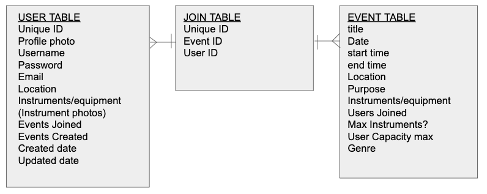
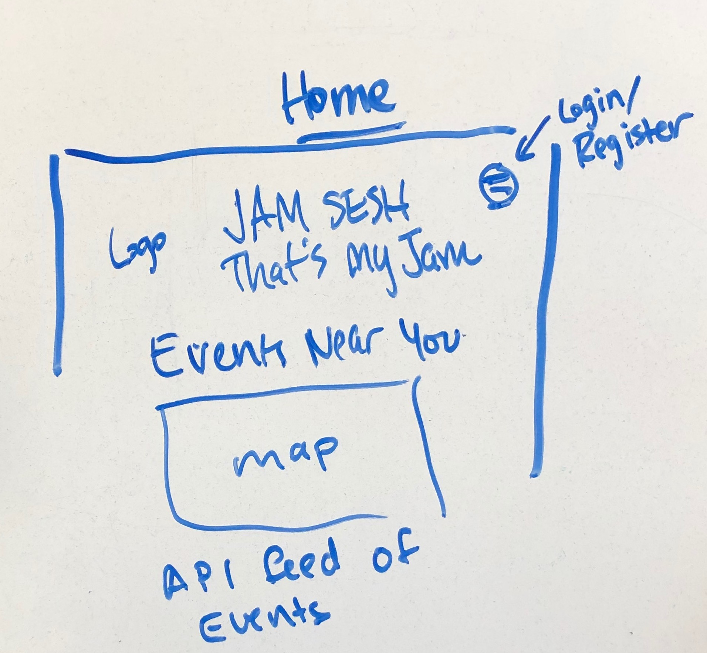
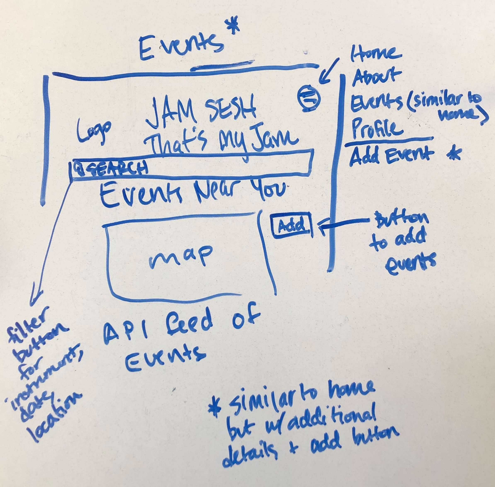

# JAMBAND

## A virtual community of musicians where you can post jam sessions you'd like to host and invite other musicians to connect with you to play music together
### How does it work?
> Do you feel like jamming?  You play the guitar, but you need a drummer and a bassist?  Or, you're missing the fourth in your string quartet? JamBand connects you with other musicians so you can play music together!

### How it works
1. [Click here to go to JamBand!](https://jamband.herokuapp.com/event)
2. click "Register" in the top left corner to create a username and profile.
3. Add a jamming event so that others near you can join the event!

### Technologies Used
- JavaScript
- HTML5
- CSS3
- React
- SQL
- Sqlite (in development)
- Peewee
- Flask
- Python 

### Wireframe
#### Planning the layout of the SQL data tables

##### The Home page

##### Events page

### The Group
This project was painstakenly and tirelessly worked on by Jeremy Yandell and Erin Johnson.  Erin was the github manager and drafted the readme file.  Jeremy and Erin mostly created this app using pair programming with a driver/navigator format where one person typed while the other directed.  During this process the pair communicated well with each other to solve challenging problems despite different ways of learning and troubleshooting.

#### Future Features We'd Love to Add
- Search by 

#### Road blocks or works in progress
- only 